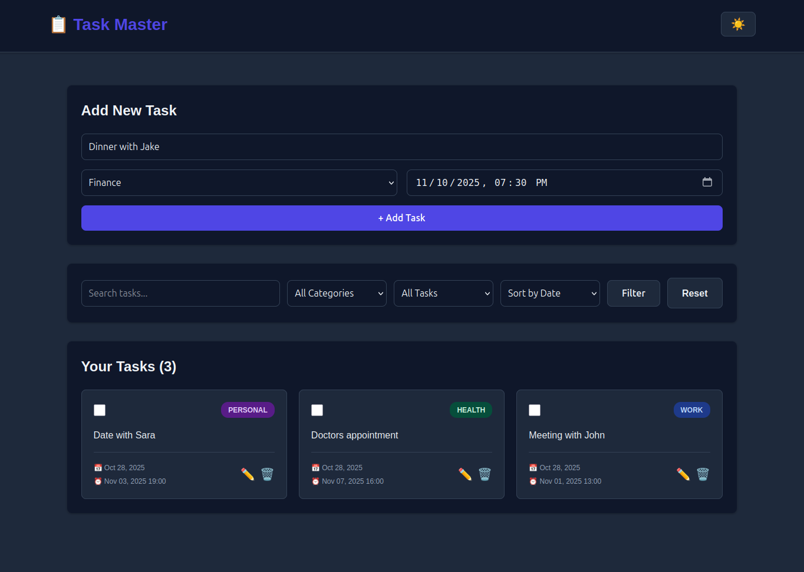

# ✅ Task-Master — A Modern Flask Task Manager

[](https://task-master-demo.onrender.com)
[](https://flask.palletsprojects.com)
[](https://www.python.org/)
[](https://www.sqlalchemy.org/)
[](#license)


A professional, mobile-friendly web app to manage your tasks efficiently. Task Master lets you organize, search, sort, and complete tasks with categories and deadlines with a persistent dark/light theming — all on a clean UI. 

The **live demo** runs entirely in session for instant preview on Render’s free plan.



---


## Features

- **📂 Task Categories**: Organize tasks by Work, Study, Personal, Health, Shopping, or Other.  
- **✅ Completion Checkboxes**: Mark tasks as done to cross them out or easily undo.
- **🔍 Search & Sort**: Search, filter and sort tasks by category, date added or completion.  
- **🌗 Dark/Light Theme**: Instantly toggle your UI preference.
- **💻 Responsive Modern Design**: Animated transitions, hover effects, rounded cards, and robust mobile support.
- **🛠️ Robust Error Handling**: Informative messages keep you in control.
- **🧱 Modular Flask Structure**: Class-based logic, blueprints, and scalable organization.
- **🧪 Unit Tests**: Coverage for route and data logic.
- **☁️ Ready for Render**: Easy one-click deployment.

---


## Technologies Used

- Backend: Python (3.12+ recommended), Flask, SQLAlchemy
- Frontend: HTML, CSS, JavaScript 
- Database: SQLite (full version), session (demo version)
- Testing: unittest 
- Deployment: Render (Procfile + runtime.txt)

---


## Project Structure

```
task_master/
├── app/
│ ├── init.py           # App factory, DB setup
│ ├── models.py         # SQLAlchemy Task model
│ ├── routes.py         # Blueprint routes + TaskManager
│ ├── forms.py          # Category/deadline validation
│ ├── static/
│ │ ├── css/
│ │ │ └── main.css      # UI styles, dark/light theme
│ │ └── js/
│ │ └── main.js         # Theme toggle, UI animations
│ └── templates/
│ ├── base.html         # Main layout
│ ├── index.html        # Tasks list & entry form
│ └── update.html       # Edit existing task
├── tests/
│ └── test_app.py       # Unittest coverage
├── config.py           # App configs (dev/prod)
├── run.py              # Entrypoint (supports Gunicorn)
├── requirements.txt    # Python dependencies
├── Procfile            # Gunicorn start command (Render)
├── runtime.txt         # Python version for Render
├── .gitignore          # Files/folders ignored by git
├── README.md           # This file
└── LICENSE             # MIT license 

demo/
├── app.py              # Session-based demo app
├── templates/          # UI templates (same structure)
├── static/             # CSS, JS assets (same as full)
├── requirements.txt
├── Procfile
└── runtime.txt
```

---


## Quickstart (Local)

### Full Database Version

1. Create and activate a virtualenv:
```bash
python -m venv .venv
source .venv/bin/activate
```

2. Install dependencies:
```bash
pip install -r requirements.txt
```

3. Run the app locally:
```bash
python run.py
```
Open http://127.0.0.1:5000

For production: run with Gunicorn
```bash
gunicorn run:app
```

---


## Testing

### Run all tests
```bash
python tests/test_app.py
```

---

## Deployment on Render

### Full Version

1. Create a PostgreSQL DB (for best persistence) — add its Internal Database URL to Render environment as DATABASE_URL.
2. Set up a Render web service:
   - Root: `task_master`
   - Build: `pip install -r requirements.txt`
   - Start: `gunicorn run:app`
   - Set environment:  
     ```
     FLASK_ENV=production
     SECRET_KEY=your-secret-key
     DATABASE_URL=your-postgres-url
     ```
3. Push code, Render builds and deploys automatically.

### Demo Version

1. Create a Render web service:
   - Root: `demo`
   - Build: `pip install -r requirements.txt`
   - Start: `gunicorn app:app`
   - Set environment:  
     ```
     FLASK_ENV=production
     ```
2. Done! No database required — all tasks live in session.

---


## How it works — Key Flows

### Main task flow

1. Add a new task with description, category, and optional deadline.
2. Tasks appear in a colorful, responsive card layout.
3. Filter/search/sort with instant UI feedback.
4. Check tasks off via the completion checkbox.
5. Overdue tasks highlight visually.
6. Edit or delete any task — full error handling ensures reliability.
7. Toggle UI theme — theme is saved for future visits.

---

## Technical Highlights

- Modular: Flask blueprints, class-based TaskManager, organized templates/static.
- Client-side dark/light theme with localStorage persistence.
- All actions animated for maximal UX polish.
- Robust validation and user feedback.
- Unit-tested backend logic.
- Session-based and DB-backed dual modes — choose for scalability or instant demo.
- Render deployment files included.

---

## Future Enhancements

- [ ] User authentication and profiles  
- [ ] Task reminders (notifs or email)
- [ ] Push notifications for deadlines
- [ ] Optional multi-user or team mode
- [ ] Export/import tasks (.csv, .json)
- [ ] Dockerfile for containerized deployment

---

## License

This project is licensed under the MIT License — free to use, modify, and distribute with attribution.

---

**Developed by Dimitar Karaskakovski**  
[GitHub Portfolio](https://github.com/dimitar-sudo)
